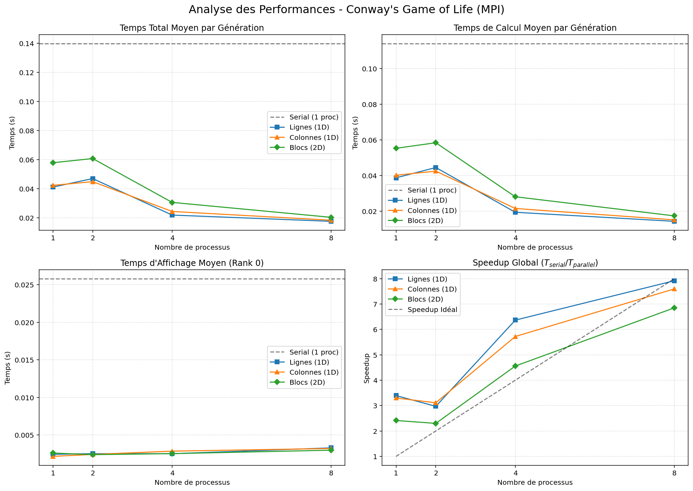

# Projet : Jeu de la Vie (Conway) - Parallélisation MPI
### Auteurs:

-Junwen XIAO

Ce dépôt présente l'implémentation et l'analyse de performances du célèbre automate cellulaire "Jeu de la Vie" de Conway, parallélisé à l'aide de **MPI** (`mpi4py`). 

L'objectif de cette étude est de comparer les temps d'exécution de différentes stratégies de décomposition de domaine (Lignes 1D, Colonnes 1D, Blocs 2D) par rapport à une version sérielle de référence, en faisant varier le nombre de processus.

## Description des fichiers

* **`linesplit.py` (Parallélisation 1D par lignes)** : Divise l'univers de simulation en bandes horizontales réparties entre les différents processus (Row block distribution). Utilise des communications MPI non-bloquantes (`Irecv`, `Isend` et `Waitall`) pour synchroniser les lignes fantômes (halos) entre les sous-grilles voisines de manière asynchrone. Le processus Maître (Rank 0) rassemble les données et s'occupe de l'affichage.
* **`colsplit.py` (Parallélisation 1D par colonnes)** : Applique le même principe de base que la division par lignes, mais en découpant la grille en tranches verticales (Column block distribution). Les données échangées aux frontières sont ici des colonnes, toujours via des communications non-bloquantes.
* **`2Dsplit.py` (Parallélisation 2D par blocs)** : Implémente un partitionnement spatial optimisé sous forme de sous-grilles 2D. Cette version intègre une logique avancée avec un échange de données en deux phases (verticale, puis horizontale avec transport implicite des coins). Elle exploite un fort recouvrement (overlap) entre les calculs du noyau central et les communications réseau pour maximiser l'efficacité.
* **`game2process.py` (Architecture Maître/Esclave dédiée)** : Une version spécifique et didactique nécessitant exactement deux processus. Elle sépare strictement les responsabilités : le Processus 0 effectue 100% des calculs de la grille, tandis que le Processus 1 est dédié exclusivement à l'affichage. Pour optimiser le trafic réseau, seules les cellules ayant changé d'état (les différences) sont transmises à chaque itération.
* **`ben.py` (Script de Benchmark)** : Outil d'analyse des performances automatisé permettant d'évaluer les différentes stratégies (Série, Lignes, Colonnes, Blocs 2D). Il exécute les scripts sur un nombre variable de processus (1, 2, 4, 8). Il parse les sorties standard pour extraire les temps de calcul et d'affichage, calcule l'accélération (Speedup), puis génère un tableau récapitulatif ainsi que 4 graphiques comparatifs en utilisant `pandas` et `matplotlib`.

--

##  1. Tableau Résumé des Performances

Les tests ont été réalisés sur une grille de **800x800**, avec le motif `glider`. Les temps indiqués sont des moyennes par génération (en secondes).

| Stratégie     | Processus | Calcul (s) | Affichage (s) | Total (s) | Speedup |
|:--------------|----------:|-----------:|--------------:|----------:|--------:|
| **Serial** | 1         | 0.1140     | 0.0258        | 0.1398    | 1.0000  |
| **Lignes (1D)**| 1         | 0.0388     | 0.0024        | 0.0412    | 3.3942  |
| Lignes (1D)   | 2         | 0.0445     | 0.0025        | 0.0471    | 2.9710  |
| Lignes (1D)   | 4         | 0.0195     | 0.0025        | 0.0220    | 6.3676  |
| Lignes (1D)   | 8         | 0.0144     | 0.0033        | 0.0177    | 7.9185  |
| **Colonnes (1D)**| 1       | 0.0402     | 0.0022        | 0.0424    | 3.2990  |
| Colonnes (1D) | 2         | 0.0425     | 0.0024        | 0.0449    | 3.1112  |
| Colonnes (1D) | 4         | 0.0216     | 0.0028        | 0.0244    | 5.7226  |
| Colonnes (1D) | 8         | 0.0152     | 0.0032        | 0.0184    | 7.5974  |
| **Blocs (2D)**| 1         | 0.0553     | 0.0026        | 0.0579    | 2.4133  |
| Blocs (2D)    | 2         | 0.0584     | 0.0024        | 0.0608    | 2.2988  |
| Blocs (2D)    | 4         | 0.0282     | 0.0025        | 0.0307    | 4.5588  |
| Blocs (2D)    | 8         | 0.0174     | 0.0030        | 0.0204    | 6.8512  |

---

##  2. Visualisation Graphique

---

## 3. Analyse et Commentaires

À partir des données récoltées et des graphiques générés, plusieurs conclusions intéressantes peuvent être tirées :

### A. L'anomalie apparente du Speedup initial (> 1)
On remarque immédiatement qu'avec **1 seul processus**, les versions MPI affichent un Speedup spectaculaire (ex: ~3.4x pour la découpe en lignes) par rapport à la version `Serial`. Cela s'explique par une **optimisation algorithmique majeure** introduite lors de la réécriture des versions parallèles, indépendamment de MPI :
* **Calcul :** La version sérielle instancie des tableaux NumPy pour chaque cellule à chaque itération, ce qui est très coûteux. Les versions MPI lisent directement les valeurs adjacentes dans la matrice, réduisant drastiquement le temps de calcul brut (de ~0.11s à ~0.04s).
* **Rendu Graphique :** La version sérielle dessine les pixels un par un avec `pygame.draw.rect`. Les versions parallèles utilisent `pygame.surfarray`, une approche vectorisée qui divise le temps d'affichage par 10 (de ~0.025s à ~0.002s).

### B. Efficacité de la parallélisation (Scalabilité)
* **Lignes vs Colonnes (1D) :** La décomposition en lignes 1D offre les meilleures performances globales, atteignant un Speedup de **7.9** pour 8 processus (très proche du Speedup idéal). La découpe en colonnes suit de très près (Speedup de 7.5). Cette légère différence en faveur des lignes peut s'expliquer par la disposition en mémoire de NumPy (Row-major), qui rend l'accès et l'envoi de blocs de lignes plus rapides.
* **Décomposition en Blocs (2D) :** La stratégie 2D est légèrement en retrait (Speedup de ~6.8 à 8 processus). Bien qu'elle réduise mathématiquement le périmètre des halos de communication à grande échelle, pour une grille de 800x800 et un faible nombre de cœurs (≤ 8), la complexité supplémentaire de devoir communiquer dans 4 directions (haut, bas, gauche, droite) génère un surcoût (_overhead_) par rapport aux communications unidirectionnelles des versions 1D.

### C. Stabilité du temps d'affichage
Le graphique du "Temps d'Affichage Moyen" montre que le coût du rendu (réalisé uniquement par le Master, Rank 0) reste globalement **constant et très bas**, quel que soit le nombre de workers ou la stratégie. Cela confirme que l'étape limitante (le goulot d'étranglement) a bien été déplacée vers le calcul, justifiant ainsi la pertinence de la parallélisation MPI pour cette simulation.
